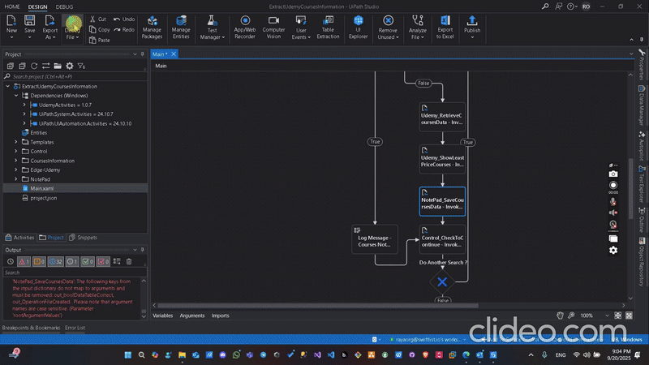

# Udemy Courses Automation Project

This repository contains a UiPath workflow automation project and a custom UiPath library for automating the extraction and management of Udemy course information. The solution is modular, reusable, and demonstrates best practices in RPA development with UiPath.

---

## Project Structure

- **ExtractUdemyCoursesInformation - 1.3/**: Main UiPath process project for automating Udemy course data extraction and related operations.
- **UdemyActivities/**: Custom UiPath library containing reusable activities for Udemy and Outlook automation.
- **AutomationRecording.gif**: Animated demonstration of the automation in action.

---

## Main Workflows & Their Purposes

### ExtractUdemyCoursesInformation - 1.3

- **Main.xaml**: Orchestrates the end-to-end process of launching Udemy, logging in, searching for courses, retrieving course data, and saving results. Integrates all sub-workflows and custom activities.
- **Edge-Udemy/**
  - **Udemy_RetrieveCoursesData.xaml**: Retrieves course data from Udemy, outputs as a DataTable.
  - **Udemy_SearchCourses.xaml**: Searches for courses on Udemy based on a query.
  - **Udemy_ShowLeastPriceCourses.xaml**: Displays the courses with the lowest prices from the extracted data.
- **NotePad/**
  - **NotePad_SaveCoursesData.xaml**: Saves the extracted courses data to a Notepad file for easy access and review.
- **Control/**
  - **Control_CheckToLogin.xaml**: Checks if the user is logged out and needs to log in.
  - **Control_CheckToContinue.xaml**: Determines if the automation should continue searching for more courses.

---

## Custom Library Activities (UdemyActivities)

- **Udemy_LaunchApp.xaml**: Launches the Udemy website or app for automation.
- **Udemy_Login.xaml**: Handles the login process to Udemy, including retries and input validation.
- **Udemy_Logout.xaml**: Logs out from Udemy safely.
- **Udemy_CloseApp.xaml**: Closes the Udemy application or browser session.
- **Components/Outlook/OutLook_GetVerificationCode.xaml**: Retrieves verification codes from Outlook emails, used for two-factor authentication or email confirmation during login.
- **Components/Udemy/Udemy_ProceedToLogin.xaml**: Proceeds with the login process, handling retries and timeouts.
- **Components/Udemy/Udemy_ConfirmLogin.xaml**: Enters the received confirmation code and completes the login process.

---

## Workflow Overview

1. **Launch Udemy**: The automation starts by launching the Udemy website/app.
2. **Login**: Uses custom activities to log in, including handling verification codes from Outlook if required.
3. **Search Courses**: Searches for courses based on user-defined criteria.
4. **Retrieve Data**: Extracts course information and stores it in a structured format.
5. **Show Least Price Courses**: Highlights the courses with the lowest prices.
6. **Save Data**: Saves the results to a Notepad file for further use.
7. **Logout & Close**: Logs out and closes the Udemy session.

---

## Demo

---

## How to Use

1. **Open in UiPath Studio**: Open the `ExtractUdemyCoursesInformation - 1.3` folder as a UiPath project.
2. **Restore Dependencies**: Dependencies are managed via NuGet and will restore automatically.
3. **Run the Workflow**: Execute `Main.xaml` to start the automation.
4. **Reuse the Library**: Import `UdemyActivities.1.0.7.nupkg` into other UiPath projects as needed.

---

## Notes

- The project is modular and can be extended for other automation scenarios.
- The custom library can be reused in other UiPath projects for similar login, logout, and email verification tasks.
- The GIF demo provides a visual overview of the automation process.

---

**Author:** amrayman999

**License:** For educational and demonstration purposes.
