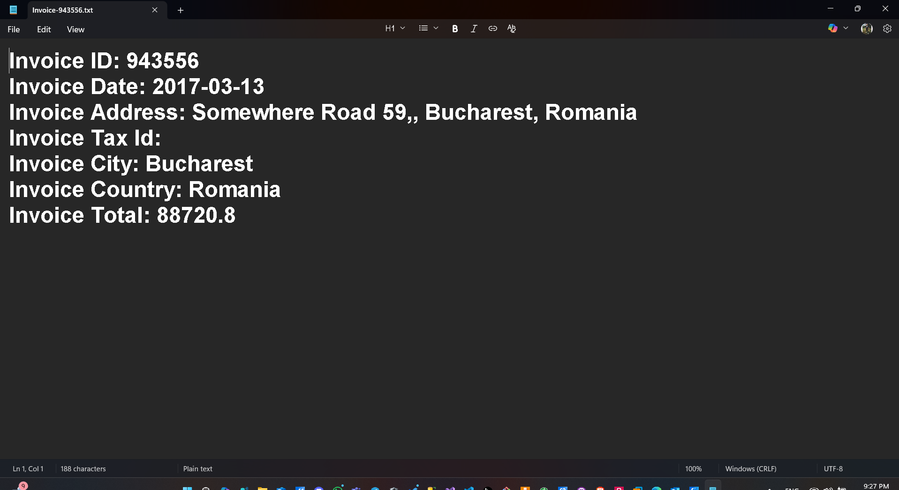

# ExtractACMEInvoicesInformation

This project is part of the Automation Developer Associate training. It demonstrates how to extract information from a set of PDF invoices and write the extracted data to text files. 

## Project Structure

- **Main.xaml**: The main workflow file.
- **PDF_ExtractInfo.xaml**: Workflow for extracting information from PDF invoices.
- **Text_WriteInfo.xaml**: Workflow for writing extracted information to text files.
- **Invoices/**: Contains sample PDF invoices.
- **Invoices Information/**: Contains the output text files with extracted invoice information.
- **SampleOutput.png**: Example of the expected output.

## How It Works

1. The workflow reads each PDF invoice from the `Invoices` folder.
2. It extracts relevant information (such as invoice number, date, vendor, and total amount) using the `PDF_ExtractInfo.xaml` workflow.
3. The extracted information is written to a corresponding text file in the `Invoices Information` folder using the `Text_WriteInfo.xaml` workflow.

## Sample Output

Below is a sample output image showing the result of the extraction process:

## Notes

- This project does not use automation recording. All workflows are built manually.
- Make sure to have the required dependencies installed as specified in `project.json`.
- You can add more PDF invoices to the `Invoices` folder to test the extraction process.

---

