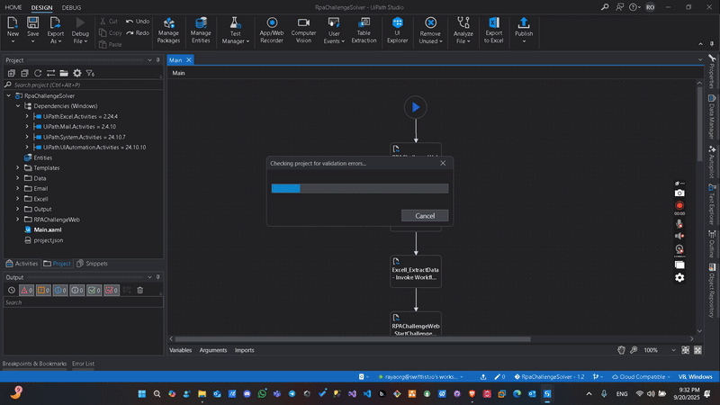
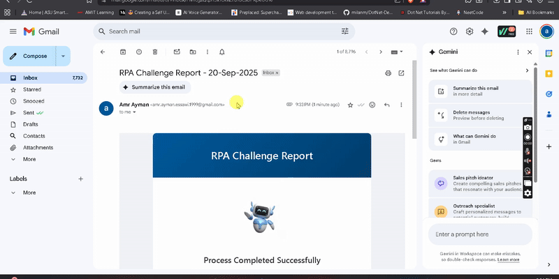

# RPA Challenge Solver

This project automates the RPA Challenge using UiPath. It extracts data from Excel, interacts with a web application, and sends email reports. Below you will find:
- Project overview
- Demo GIFs

## Project Overview
- **Platform:** UiPath
- **Main Workflow:** `Main.xaml`
- **Data:** Located in `Data/`
- **Email Automation:** `Email/`
- **Excel Automation:** `Excell/`
- **Web Automation:** `RPAChallengeWeb/`

## Demo GIFs
### Automation Recording

### Output Recording

## How It Works
1. Launches the RPA Challenge website
2. Downloads the challenge data
3. Extracts data from Excel
4. Fills and submits the web form for each record
5. Takes screenshots and saves results
6. Sends email reports with results and screenshots

## Folder Structure
- `Main.xaml`: Main workflow
- `Data/`: Input data, templates, and screenshots
- `Email/`: Email automation workflows
- `Excell/`: Excel data extraction workflows
- `Output/`: Output and screenshot saving workflows
- `RPAChallengeWeb/`: Web automation workflows

---

