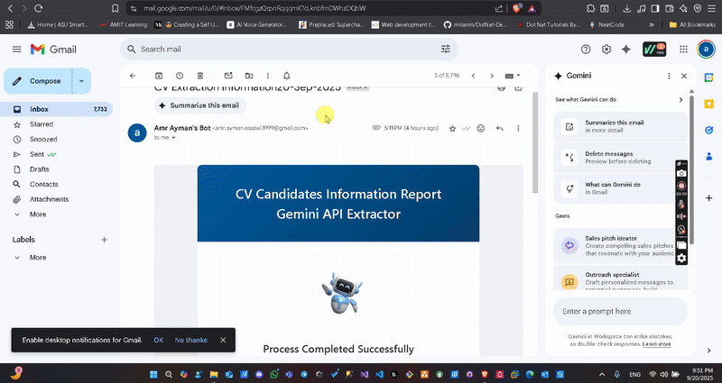
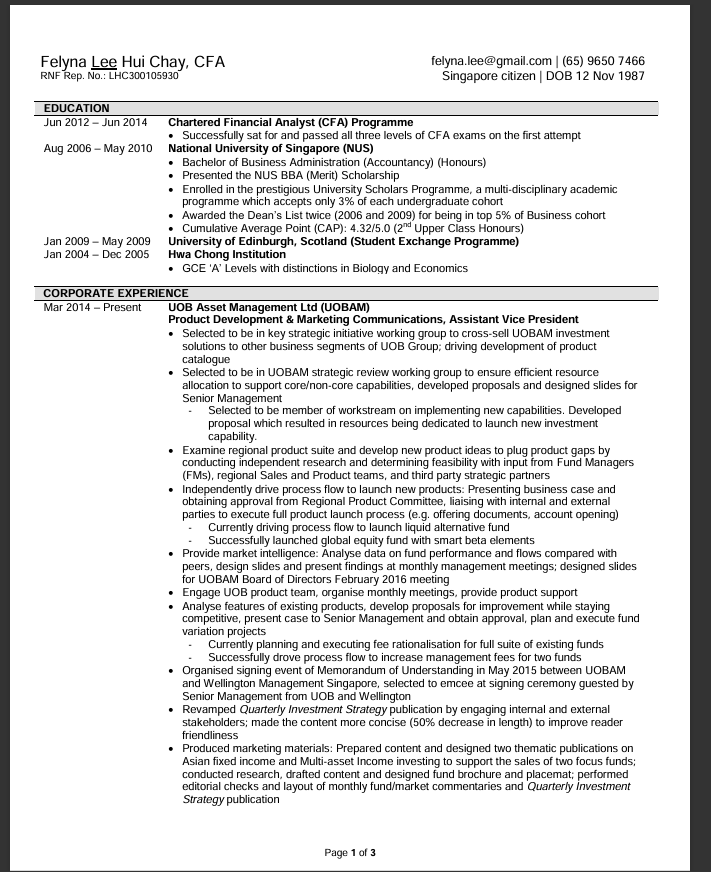

# CV Information Extractor (UiPath RPA Project)


## Overview
This project automates the extraction of candidate information from CVs (PDF format) using UiPath workflows. It leverages both AI-based and rule-based extraction methods, manages data in Excel, and sends summary reports via email. The automation is designed for HR/recruitment scenarios to streamline candidate data collection and reporting.

---

## Output Recording


## Sample Input


---

## Features
- **AI Extraction**: Uses Gemini API and UiPath Document Understanding for extracting structured data from CVs.
- **Rule-Based Extraction**: Option to use traditional extraction methods.
- **Batch Processing**: Loops through multiple CV files in a folder.
- **Data Management**: Stores extracted data in Excel files for further analysis.
- **Email Automation**: Sends summary reports to stakeholders.
- **User Prompts**: Allows user to choose extraction method.

---

## Project Structure
```
CVInformationExtractor/
├── Main.xaml
├── project.json
├── AIExtraction/
│   ├── AIExtraction_ExtractWithGeminiAPI.xaml
│   └── AIExtraction_ExtractWithUiPath.xaml
├── Control/
│   ├── Control_LoopOnFiles.xaml
│   └── Control_PromptUserExtractionChoice.xaml
├── Data/
│   ├── Emails.xlsx
│   ├── EmailTemplate.html
│   ├── JsonBody.txt
│   ├── Prompt.txt
│   ├── CandidatesData/
│   │   └── [Extracted Excel files]
│   └── CVs/
│       └── [Input CV PDFs]
├── DataManagement/
│   └── DataManagement_Build.xaml
├── Email/
│   ├── Email_SendReportToAll.xaml
│   └── Email_SendResultReport.xaml
├── Excell/
│   ├── Excell_ExtractEmailsData.xaml
│   └── Excell_SaveCVsData.xaml
```

---

## Input & Output
- **Input CVs**: Place PDF files in `CVInformationExtractor/Data/CVs/`.
- **Extracted Data**: Excel files generated in `CVInformationExtractor/Data/CandidatesData/`.
- **Email Reports**: Sent using templates in `CVInformationExtractor/Data/EmailTemplate.html`.

---


## How to Run
1. Open the project in UiPath Studio.
2. Set up dependencies as per `project.json`.
3. Place input CVs in the `Data/CVs/` folder.
4. Run `Main.xaml`.
5. Follow prompts to select extraction method.
6. Check output Excel files and email inbox for reports.

---

## Dependencies
- UiPath Studio (2022.10 or later recommended)
- Excel activities package
- Mail activities package
- [Optional] UiPath Document Understanding
- [Optional] Gemini API access

---

## Customization
- Update `Prompt.txt` for custom AI prompts.
- Modify `EmailTemplate.html` for report formatting.
- Adjust extraction workflows for additional fields as needed.

---

## Authors
- Automation Developer Associate Training

---

## License
This project is for educational and demonstration purposes only.
